# Eve Platform Architecture

This document provides a comprehensive overview of Eve's system architecture, design patterns, and technical decisions.

## Table of Contents

- [Overview](#overview)
- [System Architecture](#system-architecture)
- [Microservices](#microservices)
- [Data Layer](#data-layer)
- [Communication Patterns](#communication-patterns)
- [Key Workflows](#key-workflows)
- [Technology Decisions](#technology-decisions)
- [Scalability Considerations](#scalability-considerations)
- [Security Architecture](#security-architecture)

## Overview

Eve is a **microservices-based** ride-matching platform designed for scalability, maintainability, and real-time performance.

### Core Principles

1. **Microservices Architecture**: Separate, independently deployable services
2. **API Gateway Pattern**: Single entry point for all clients
3. **Real-time Communication**: WebSocket for live updates
4. **Geospatial Optimization**: H3 hexagonal indexing for fast matching
5. **Auth0 Integration**: Secure, managed authentication
6. **Type Safety**: TypeScript across the entire stack

## System Architecture

### High-Level Overview

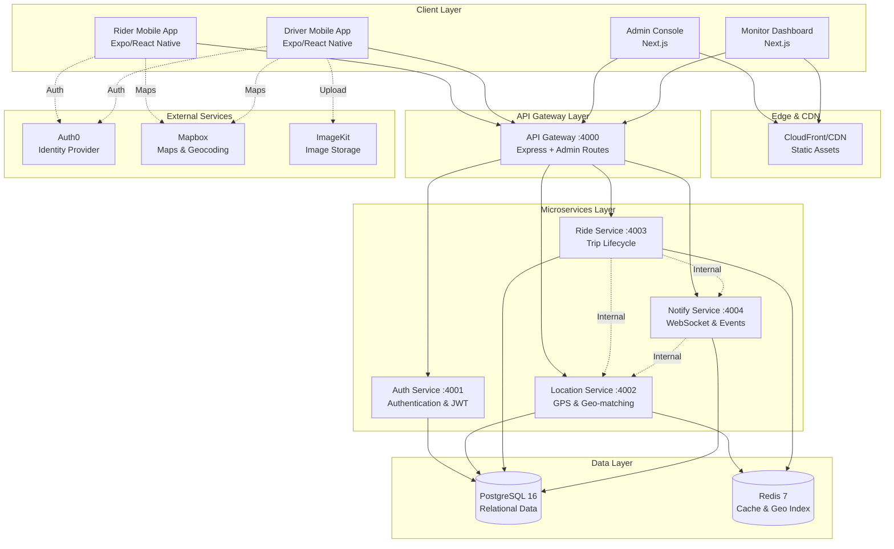

### Deployment Modes

Eve supports two operational modes:

#### Compose Mode (Development)
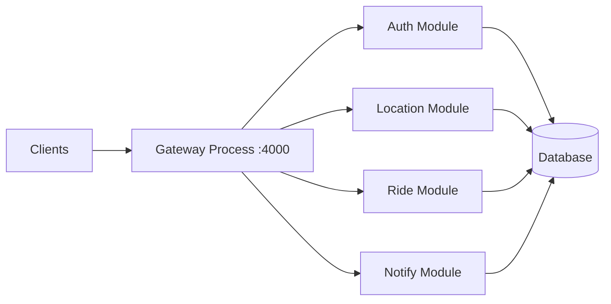

**Characteristics**:
- Single Node.js process
- Faster startup time
- In-process communication
- Ideal for local development

#### Proxy Mode (Production)
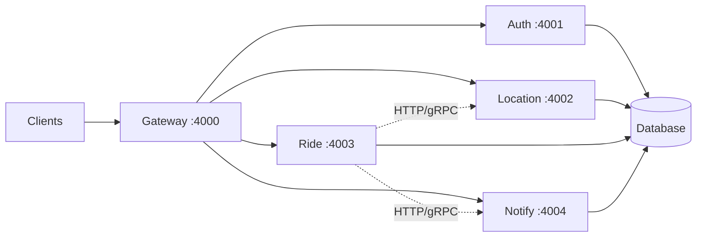

**Characteristics**:
- Separate processes per service
- Independent scaling
- HTTP/gRPC inter-service communication
- Production deployment model

## Microservices

### Service Responsibilities

#### Gateway Service (Port 4000)

**Responsibilities**:
- Route client requests to appropriate services
- Serve admin API endpoints
- CORS configuration
- Rate limiting
- Health checks

**Endpoints**:
- `/api/auth/*` → Auth service
- `/api/rider/*` → Ride service
- `/api/driver/*` → Auth, Location, Ride (depending on path)
- `/api/admin/*` → Local admin routes
- `/socket.io/*` → Notify service

**Key Files**:
- `backend/gateway/src/server.ts` - Main entry point
- `backend/gateway/src/compose-app.ts` - Compose mode
- `backend/gateway/src/proxy-app.ts` - Proxy mode

#### Auth Service (Port 4001)

**Responsibilities**:
- Auth0 ID token verification
- Eve JWT issuance
- Admin email/password authentication
- Session management
- User profile retrieval

**Key Operations**:
- `POST /api/auth/auth0` - Rider Auth0 exchange
- `POST /api/auth/driver/auth0` - Driver Auth0 exchange
- `POST /api/auth/admin/login` - Admin login
- `GET /api/auth/me` - Current user info

**Key Files**:
- `backend/services/auth/src/server.ts`
- `backend/packages/shared/src/jwt.ts` - JWT utilities

#### Location Service (Port 4002)

**Responsibilities**:
- Track driver GPS positions
- Maintain H3 geospatial index in Redis
- Find nearby drivers for rider requests
- Find nearby trips for drivers
- Calculate distances

**Key Operations**:
- `POST /api/driver/presence` - Update driver location & status
- `GET /internal/nearby-drivers` - Find drivers near pickup
- `GET /internal/nearby-trips` - Find trips near driver
- `POST /internal/distance` - Calculate distance

**Key Technologies**:
- **Uber H3**: Hexagonal geospatial indexing (resolution 8, ~0.46km)
- **Redis Sets**: Store driver/trip IDs by H3 cell
- **Haversine Formula**: Distance filtering

**Key Files**:
- `backend/services/location/src/server.ts`
- `backend/services/location/src/h3.ts` - H3 operations
- `backend/services/location/src/matching.ts` - Matching logic
- `backend/docs/h3-matchmaking.md` - Detailed documentation

#### Ride Service (Port 4003)

**Responsibilities**:
- Trip lifecycle management
- Offer submission and acceptance
- Fare calculation
- Trip state transitions
- Driver-trip matching

**Trip States**:
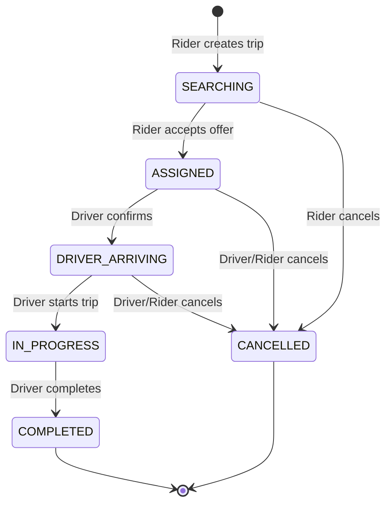

**Key Operations**:
- `POST /api/rider/trips` - Create trip request
- `POST /api/driver/offers` - Submit fare offer
- `POST /api/rider/trips/:id/accept-offer` - Accept offer
- `PATCH /api/driver/trips/:id` - Update trip status

**Key Files**:
- `backend/services/ride/src/server.ts`
- `backend/services/ride/src/rider.service.ts`
- `backend/services/ride/src/driver.service.ts`
- `backend/services/ride/src/dispatch.ts` - Matching logic

#### Notify Service (Port 4004)

**Responsibilities**:
- WebSocket connection management (Socket.IO)
- Real-time event broadcasting
- Trip room management
- User-specific notifications

**Event Types**:
- `trip:*` - Trip lifecycle events
- `offer:*` - New offers for riders
- `trip-request:*` - New trips for drivers
- `location:*` - Real-time location updates

**Key Operations**:
- WebSocket connections at `/socket.io`
- `POST /internal/emit` - Emit events to rooms/users

**Key Files**:
- `backend/services/notify/src/server.ts`
- `backend/services/notify/src/realtime.ts` - Socket.IO setup
- `backend/services/notify/src/emit.ts` - Event emission

## Data Layer

### Database Schema Overview

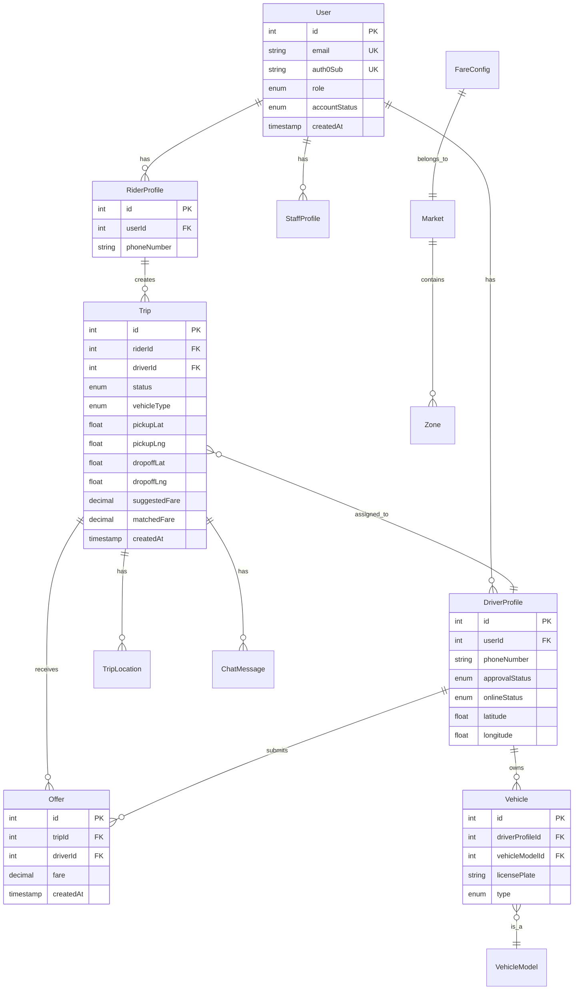

### PostgreSQL (Primary Database)

**Schema**: Managed by Prisma ORM

**Key Tables**:
- `User` - All users (riders, drivers, admin)
- `RiderProfile` - Rider-specific data
- `DriverProfile` - Driver-specific data (location, status)
- `Trip` - All trip requests and completed trips
- `Offer` - Fare offers from drivers
- `Vehicle` - Driver vehicles
- `FareConfig` - Pricing configurations
- `Market` - Geographic markets
- `Zone` - Pricing zones within markets

**Indexes**:
- `Trip.riderId, Trip.status` - Rider's active trips
- `Trip.driverId, Trip.status` - Driver's active trips
- `Trip.status` - Fast searches for SEARCHING trips
- `DriverProfile.userId, DriverProfile.approvalStatus, DriverProfile.onlineStatus` - Online driver queries
- `Offer.tripId, Offer.createdAt` - Trip offers sorted by time

**Files**:
- `backend/prisma/schema.prisma` - Schema definition
- `backend/prisma/migrations/` - Migration history

### Redis (Cache & Geospatial Index)

**Use Cases**:
1. **Geospatial Indexing** (H3)
2. **Session Caching**
3. **Fare Configuration Cache**
4. **Rate Limiting**

**Key Patterns**:

```
# H3 Geospatial Index
h3:drivers:CAR:<h3-cell>     SET of driver IDs
h3:drivers:BIKE:<h3-cell>    SET of driver IDs
h3:trips:CAR:<h3-cell>       SET of trip IDs
h3:trips:BIKE:<h3-cell>      SET of trip IDs
h3:pos:drivers               HASH driver_id → "lat,lng"
h3:pos:trips                 HASH trip_id → "lat,lng"

# Fare Configuration Cache
fare:config:{city}:{type}    HASH of fare config fields
fare:min:{city}:{type}       STRING minimum fare

# Rate Limiting
ratelimit:{ip}:{endpoint}    STRING request count (expires)
```

**Performance**:
- Geospatial queries: <5ms (vs 50-100ms in PostgreSQL)
- Fare cache hit rate: >95%
- Memory usage: ~500MB for 10,000 active drivers

**Files**:
- `backend/services/location/src/h3.ts` - H3 operations
- `backend/packages/shared/src/cache.ts` - Cache service
- `backend/docs/h3-matchmaking.md` - Geo indexing details
- `backend/docs/caching.md` - Caching strategies

## Communication Patterns

### Client-to-Gateway (HTTP/WebSocket)

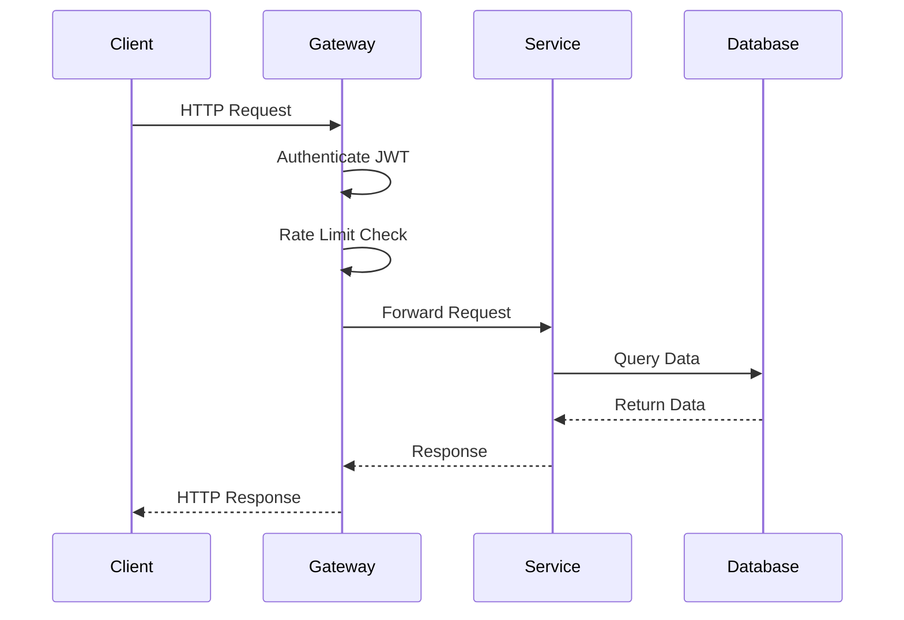

**Protocols**:
- REST over HTTP/1.1
- WebSocket (Socket.IO) for real-time
- JSON payloads
- JWT bearer tokens

### Inter-Service Communication

#### HTTP (Default)

```javascript
// Ride service calling Location service
const drivers = await fetch(`${LOCATION_URL}/internal/nearby-drivers`, {
  method: 'POST',
  headers: {
    'Content-Type': 'application/json',
    'X-Internal-Secret': INTERNAL_SERVICE_SECRET
  },
  body: JSON.stringify({ pickupLat, pickupLng, vehicleType })
});
```

#### gRPC (Optional, High Performance)

```protobuf
service LocationService {
  rpc NearbyDrivers(NearbyDriversRequest) returns (NearbyDriversResponse);
}
```

**Performance Comparison**:
- HTTP: 15-30ms latency
- gRPC: 2-5ms latency (3-10x faster)
- Enable with `GRPC_ENABLED=true`

**Files**:
- `backend/proto/*.proto` - Protocol definitions
- `backend/docs/grpc.md` - gRPC documentation

### Real-Time Updates (WebSocket)

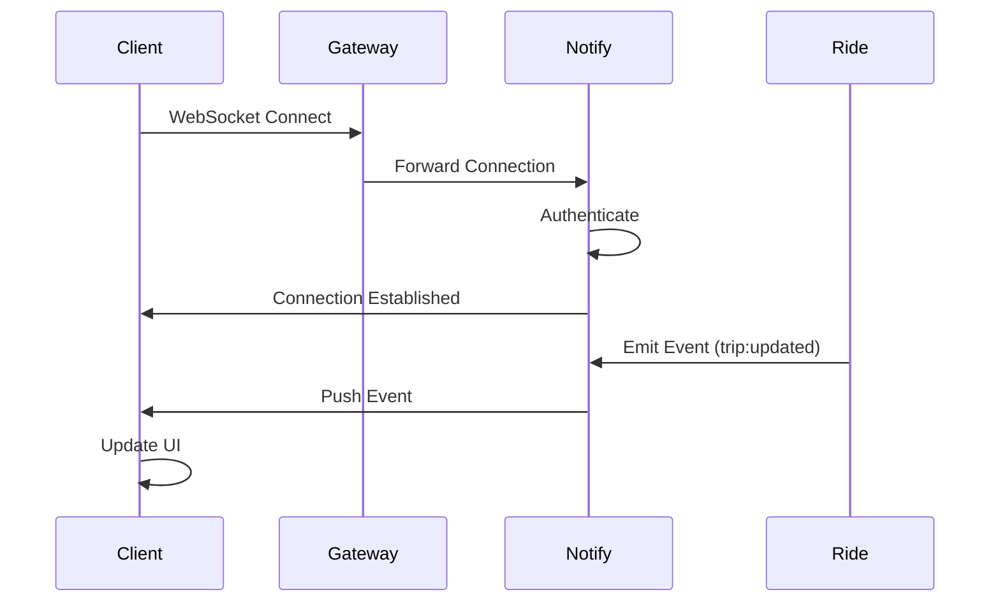

**Socket.IO Rooms**:
- `trip:{tripId}` - All participants of a trip
- `user:{userId}` - User-specific notifications
- `admin` - Admin dashboard updates

## Key Workflows

### 1. User Authentication Flow

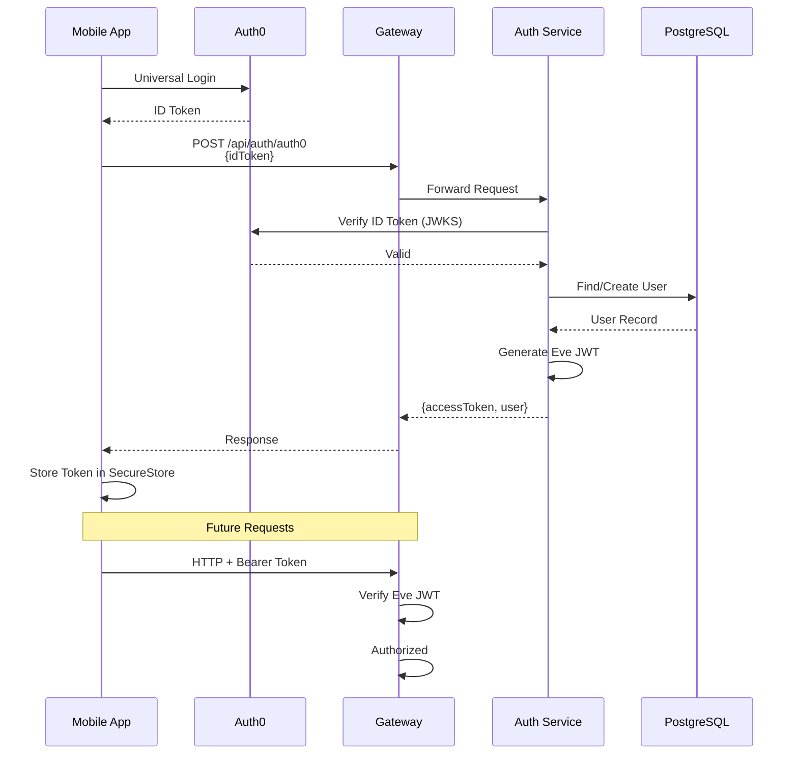

**Security**:
- Auth0 handles password management
- Eve never stores Auth0 passwords
- JWT expires in 30 days (configurable)
- Tokens stored in device SecureStore

**Files**:
- `backend/services/auth/src/server.ts`
- `backend/docs/auth.md`

### 2. Trip Request and Matching Flow

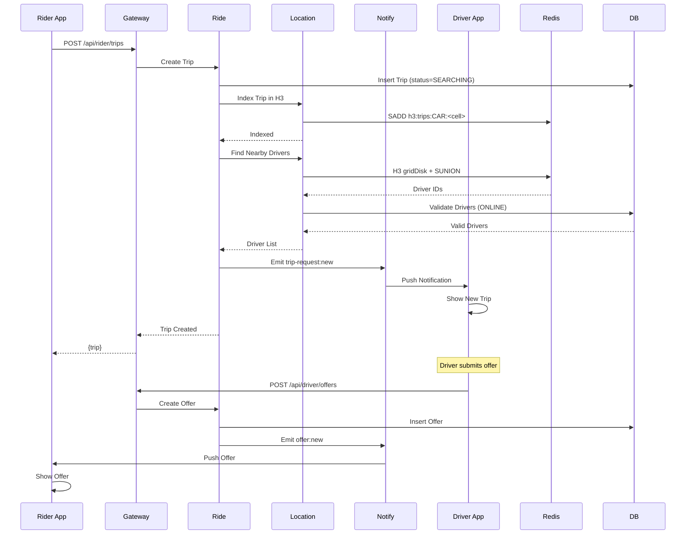

**Matching Algorithm**:
1. Index trip in H3 cells based on pickup location
2. Query Redis for online drivers in nearby H3 cells (15km radius)
3. Filter by vehicle type, approval status, online status
4. Calculate distances and sort by proximity
5. Notify top 5 closest drivers
6. Drivers submit fare offers
7. Rider chooses best offer

**Performance**:
- Trip indexing: <10ms
- Nearby driver query: <20ms
- Total trip creation: <100ms

**Files**:
- `backend/services/ride/src/rider.service.ts`
- `backend/services/location/src/matching.ts`

### 3. Real-Time Location Tracking

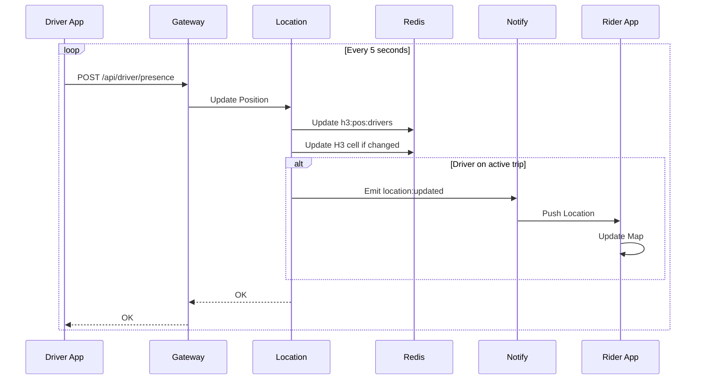

**Optimizations**:
- GPS updates every 5 seconds (configurable)
- H3 cell only updated if changed
- Database write throttled (every 15 seconds)
- Redis updated every time for real-time accuracy

### 4. Trip Lifecycle

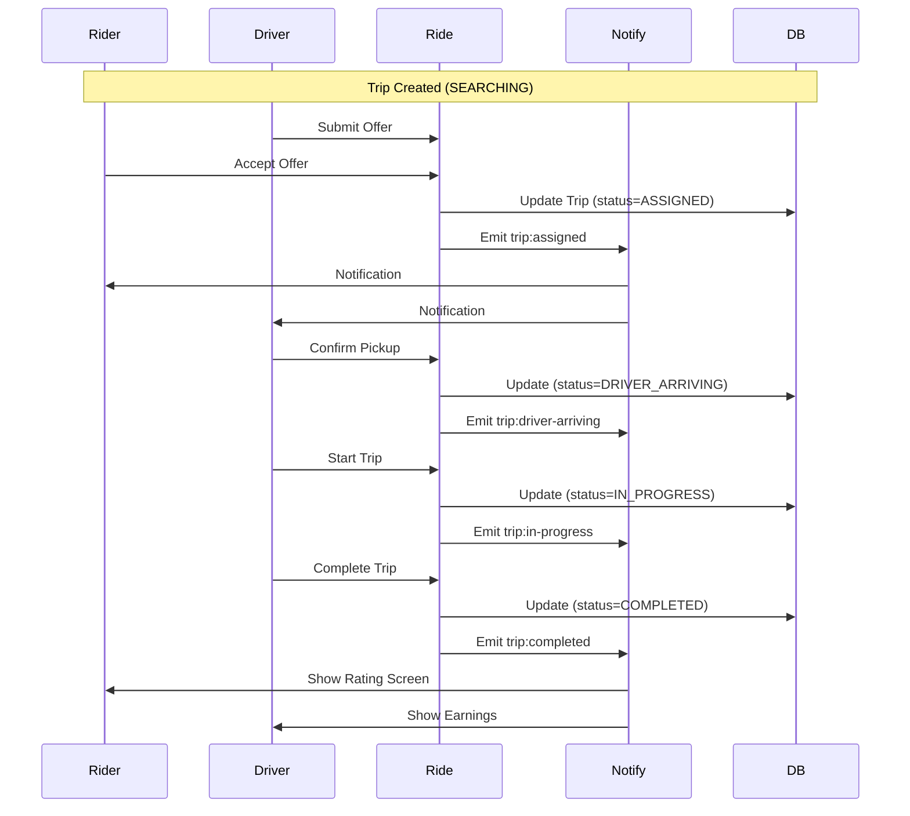

## Technology Decisions

### Why Microservices?

**Advantages**:
- ✅ Independent scaling (location service needs more resources)
- ✅ Technology flexibility per service
- ✅ Fault isolation (one service failure doesn't kill all)
- ✅ Team autonomy
- ✅ Independent deployment

**Trade-offs**:
- ❌ Increased complexity
- ❌ Network latency between services
- ❌ Distributed tracing required
- ❌ Data consistency challenges

**Mitigation**: Compose mode for development, hybrid HTTP/gRPC for performance

### Why Uber H3 for Geospatial?

**Alternatives Considered**:
- PostgreSQL PostGIS
- Redis GEO (geohash)
- Elasticsearch geo queries

**Why H3 Wins**:
- ✅ Constant-time proximity queries
- ✅ Hexagonal grids (better than squares)
- ✅ Hierarchical (multi-resolution)
- ✅ Redis-compatible (SET operations)
- ✅ 10x faster than PostGIS for our use case

**Performance**:
- PostGIS: 50-100ms for 10k drivers
- H3 + Redis: 3-10ms for 10k drivers

### Why Auth0?

**Alternatives**:
- Roll our own (password hashing, email verification, etc.)
- Firebase Auth
- AWS Cognito

**Why Auth0**:
- ✅ Security best practices built-in
- ✅ Universal Login (web view)
- ✅ MFA support
- ✅ Social login ready
- ✅ Compliance (SOC 2, GDPR)
- ✅ Excellent mobile SDKs

### Why Prisma?

**Alternatives**:
- Sequelize
- TypeORM
- Knex.js

**Why Prisma**:
- ✅ Type-safe queries
- ✅ Excellent TypeScript support
- ✅ Schema-first migrations
- ✅ Prisma Studio (DB GUI)
- ✅ Great DX (Developer Experience)

### Why Socket.IO?

**Alternatives**:
- Native WebSockets
- Server-Sent Events (SSE)
- Long polling

**Why Socket.IO**:
- ✅ Automatic reconnection
- ✅ Room support
- ✅ Fallback to polling
- ✅ Mobile SDK support
- ✅ Simple event-based API

## Scalability Considerations

### Horizontal Scaling

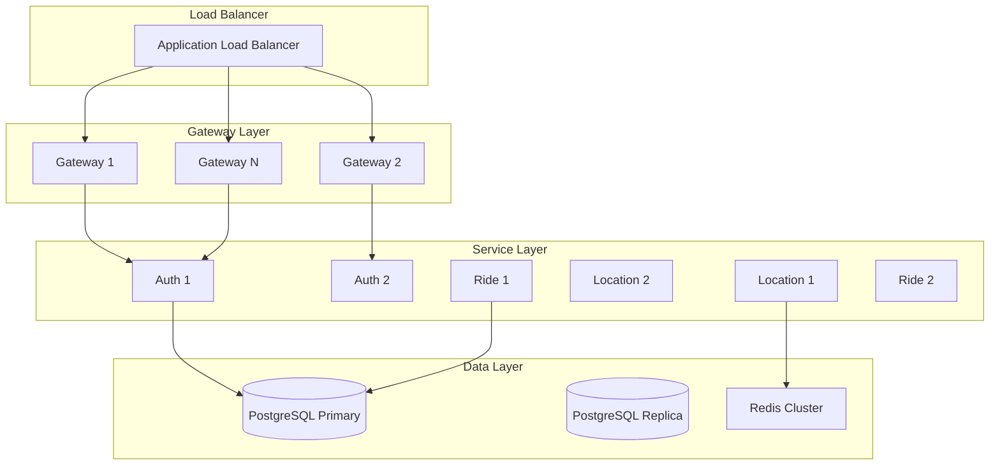

### Performance Targets

| Metric | Target | Current |
|--------|--------|---------|
| API Response Time (p95) | <200ms | ~50ms |
| WebSocket Latency | <100ms | ~30ms |
| Database Query Time (p95) | <50ms | ~20ms |
| Redis Query Time (p95) | <10ms | ~3ms |
| Concurrent Users | 10,000+ | Tested to 5,000 |
| Requests/Second | 1,000+ | Tested to 500 |

### Bottlenecks and Solutions

**Bottleneck**: Database connection pool
- **Solution**: Connection pooling (PgBouncer)
- **Solution**: Read replicas for queries

**Bottleneck**: Redis memory for geospatial
- **Solution**: Redis clustering
- **Solution**: LRU eviction policy

**Bottleneck**: WebSocket connections
- **Solution**: Sticky sessions on ALB
- **Solution**: Redis adapter for Socket.IO

**Bottleneck**: Service-to-service latency
- **Solution**: Enable gRPC
- **Solution**: Service mesh (Istio)

## Security Architecture

### Authentication Layers

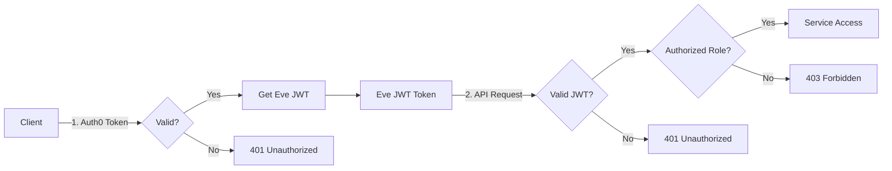

### Security Features

1. **Authentication**
   - Auth0 for mobile apps (OIDC/OAuth2)
   - Email/password for admin (bcrypt hashing)
   - JWT for API authorization
   - Secure token storage (device SecureStore)

2. **Authorization**
   - Role-based access control (RBAC)
   - Route-level middleware
   - Resource ownership validation

3. **Data Protection**
   - HTTPS only in production
   - JWT token expiration
   - Password reset tokens (time-limited)
   - Internal service secret for inter-service calls

4. **Rate Limiting**
   - 150 requests/15min per user (authenticated)
   - 30 requests/15min per IP (public)
   - Sliding window algorithm

5. **Input Validation**
   - Zod schemas for request validation
   - SQL injection prevention (Prisma parameterized queries)
   - XSS prevention (sanitization)

**See**: [SECURITY.md](SECURITY.md) for complete security documentation

## Conclusion

Eve's architecture balances:
- **Performance**: H3 geospatial, Redis caching, optional gRPC
- **Scalability**: Microservices, stateless design, horizontal scaling
- **Maintainability**: TypeScript, Prisma ORM, clear service boundaries
- **Developer Experience**: Compose mode, hot reload, comprehensive docs

**Next Steps**:
- Review [backend/docs/](backend/docs/) for service-specific details
- Read [DEPLOYMENT.md](DEPLOYMENT.md) for production setup
- Check [DEVELOPMENT.md](DEVELOPMENT.md) for development workflow

---

**Last Updated**: 2026-09-01
