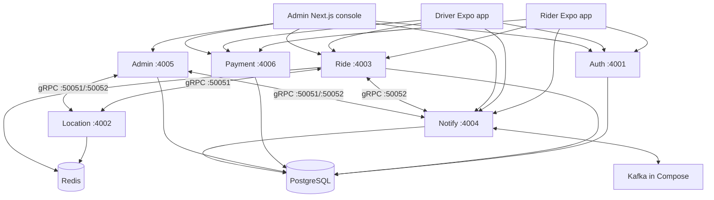

# Eve architecture

## Runtime model

Eve runs as six independently started Node.js services in `backend/services/`. `npm run dev` from `backend/` starts all six. This is the supported architecture; the partial `backend/src/` prototype and monolith Compose file are not an application runtime.

## HTTP ownership

Clients do not route through an HTTP gateway. The client and admin rewrite configuration must target the service that owns a prefix.

| Prefix | Owner | Notes |
| --- | --- | --- |
| `/api/auth` | Auth | Privy exchange, current-user profile, admin login |
| `/api/driver/login`, `/api/driver/register`, `/api/driver/privy` | Auth | Driver authentication aliases |
| `/api/rider`, `/api/driver`, `/api/public` | Ride | Trips, offers, presence, and public courier tracking |
| `/api/payment` | Payment | Escrow configuration, quotes, and confirmations |
| `/api/rider/wallet`, `/api/driver/wallet` | Payment | Wallet balances, ledger, and driver withdrawal |
| `/api/admin` | Admin | Staff-only operational APIs |
| `/socket.io` | Notify | Socket.IO connection and real-time subscriptions |

Exact service ports and local commands are maintained in [backend/docs/services-ports.md](backend/docs/services-ports.md).

## Service boundaries

### Auth

Authenticates mobile users through Privy, verifies the identity token on the server, and issues Eve JWTs. It also owns staff email/password login. Mobile clients use the Eve JWT for all further API calls.

### Location and Ride

Ride owns trip state, driver offers, presence-facing HTTP endpoints, and the trip lifecycle. Location owns H3/geo work and exposes a gRPC interface to internal consumers. Redis is required for geospatial state and cache paths.

### Notify

Notify owns Socket.IO delivery, persisted notifications, and the notify gRPC interface. Compose runs Kafka for domain events. When a local host run does not configure a broker, the services use the codebase's in-process/direct notification fallback.

### Payment

Payment owns wallet ledger views, escrow quotes and receipt confirmation. `RideEscrow` is deployed on Circle Arc Testnet. The backend holds the operator/treasury key; mobile apps only receive transaction quotes and sign with the user's Privy embedded wallet. Details, addresses, and required safeguards are in [backend/docs/driver-wallet.md](backend/docs/driver-wallet.md).

### Admin

Admin exposes staff-only operations such as drivers, riders, trips, pricing, support, safety, and ledger actions. The Next.js console proxies `/api` to these backend owners in development and production.

## Key flows

### Mobile authentication

1. A rider or driver completes a Privy SMS, email, or passkey flow.
2. The app exchanges the Privy identity token with Auth.
3. Auth resolves the user and returns an Eve JWT.
4. The app sends that JWT to Ride, Payment, and Notify.

### Trip and escrow

1. Rider creates a wallet-funded trip on Ride.
2. Driver submits an offer; rider accepts one.
3. Payment returns the escrow deposit transaction. The rider signs it with the embedded wallet and confirms the hash to Payment.
4. At completion the driver starts settlement. The operator finalizes after the dispute window unless the rider disputes.
5. A cancellation while funds remain locked returns a refund transaction for the rider to sign.

### Real-time updates

Ride and other services emit domain events through Notify. Notify publishes them over Socket.IO to authenticated participants. The apps also refetch state when screens regain focus so a missed socket event cannot be the sole source of truth.

## Application composition

| Application | Technology | Role |
| --- | --- | --- |
| `rider/` | Expo 57, React Native 0.86 | Trip request, offers, tracking, wallet, and support |
| `driver/` | Expo 57, React Native 0.86 | Onboarding, availability, offers, trip lifecycle, earnings |
| `admin/` | Next.js 16 | Staff operations console |
| `www/` | Next.js 16 | Marketing site |

## Design rules

- Keep external HTTP routes in their owning service; do not add a gateway by default.
- Keep client-visible configuration limited to `EXPO_PUBLIC_*` values. Secrets, operator keys, and contract deployment controls stay on the backend.
- Treat Payment as the source for chain configuration and transaction quotes; apps do not hardcode an escrow address.
- Use gRPC only for internal location and notify calls; use HTTP/Socket.IO at the client boundary.
