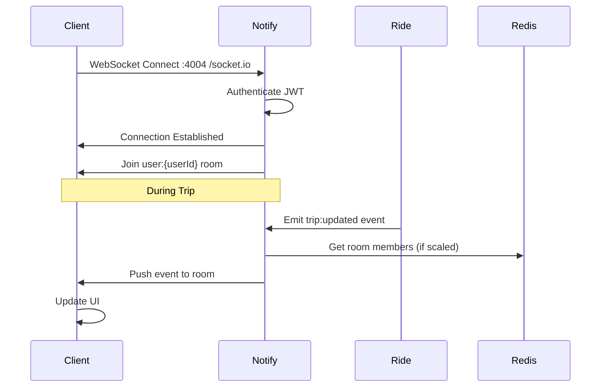

# WebSocket & Real-Time Events

Complete guide to Eve's real-time communication using Socket.IO.

## Table of Contents

- [Overview](#overview)
- [Architecture](#architecture)
- [Client Connection](#client-connection)
- [Authentication](#authentication)
- [Rooms](#rooms)
- [Events](#events)
- [Error Handling](#error-handling)
- [Best Practices](#best-practices)
- [Examples](#examples)

## Overview

Eve uses **Socket.IO** for real-time bidirectional communication between clients and the backend.

### Use Cases

- **Live location tracking** during trips
- **Real-time trip updates** (status changes)
- **Instant notifications** for new offers
- **Trip requests** to nearby drivers
- **In-trip chat** between rider and driver
- **Admin dashboard** live updates

### Why Socket.IO?

- ✅ Automatic reconnection
- ✅ Room-based broadcasting
- ✅ Fallback to HTTP long polling
- ✅ Mobile SDK support
- ✅ Event-based API
- ✅ Binary data support

## Architecture



### Service Components

**Notify Service** (`backend/services/notify/`):
- Port: 4004
- Handles WebSocket connections
- Manages rooms and subscriptions
- Broadcasts events to clients

**Clients**:
- Rider/driver: `EXPO_PUBLIC_WS_URL` (default `http://localhost:4004`)
- Admin: Next rewrite `/socket.io` → notify `:4004`

**Other services**:
- Emit via `@eve/notify` (Socket.IO in-process when attached, else gRPC on 50052)

## Client Connection

### Mobile Apps (React Native)

```typescript
// rider/src/services/socket.ts
import { io, Socket } from 'socket.io-client';
import { getToken } from './auth';

let socket: Socket | null = null;

export function connectSocket() {
  const token = await getToken();
  
  socket = io('http://api.example.com', {
    path: '/socket.io',
    transports: ['websocket', 'polling'],
    query: { token }  // JWT authentication
  });
  
  socket.on('connect', () => {
    console.log('Socket connected');
  });
  
  socket.on('disconnect', () => {
    console.log('Socket disconnected');
  });
  
  socket.on('connect_error', (error) => {
    console.error('Connection error:', error);
  });
  
  return socket;
}

export function disconnectSocket() {
  if (socket) {
    socket.disconnect();
    socket = null;
  }
}

export function getSocket(): Socket {
  if (!socket) {
    throw new Error('Socket not connected');
  }
  return socket;
}
```

### Web Apps (Next.js/React)

```typescript
// admin/lib/socket.ts
import { io } from 'socket.io-client';

export const socket = io({
  path: '/socket.io',
  transports: ['websocket', 'polling'],
  autoConnect: false
});

// Connect after login
export function connectSocket(token: string) {
  socket.auth = { token };
  socket.connect();
}
```

### Connection Options

```typescript
const socket = io('http://api.example.com', {
  path: '/socket.io',              // Path to Socket.IO endpoint
  transports: ['websocket'],        // Prefer WebSocket
  query: { token: jwtToken },       // Auth token
  reconnection: true,               // Auto-reconnect
  reconnectionDelay: 1000,          // Wait 1s before retry
  reconnectionDelayMax: 5000,       // Max 5s between retries
  reconnectionAttempts: 10,         // Try 10 times
  timeout: 20000                    // Connection timeout
});
```

## Authentication

### JWT in Query String

Clients pass JWT token in connection query:

```typescript
const socket = io('http://api.example.com', {
  query: { token: '<jwt-token>' }
});
```

### Server-Side Verification

```typescript
// backend/services/notify/src/realtime.ts
io.use(async (socket, next) => {
  const token = socket.handshake.query.token as string;
  
  if (!token) {
    return next(new Error('Authentication required'));
  }
  
  try {
    const decoded = verifyJwt(token);
    socket.data.userId = decoded.userId;
    socket.data.role = decoded.role;
    next();
  } catch (error) {
    next(new Error('Invalid token'));
  }
});
```

### Auto-Join User Room

After authentication, user automatically joins their personal room:

```typescript
io.on('connection', (socket) => {
  const userId = socket.data.userId;
  socket.join(`user:${userId}`);
  
  console.log(`User ${userId} connected`);
});
```

## Rooms

Rooms group related sockets for targeted broadcasting.

### Room Types

| Room | Members | Purpose |
|------|---------|---------|
| `user:{userId}` | Single user | User-specific notifications |
| `trip:{tripId}` | Rider + Driver | Trip lifecycle events |
| `admin` | All admin staff | Admin dashboard updates |

### Joining Rooms

**Automatic**:
- `user:{userId}` joined on connection

**Manual**:
```typescript
// Join trip room when trip is assigned
socket.emit('join-trip', { tripId: 123 });

// Server side
socket.on('join-trip', ({ tripId }) => {
  socket.join(`trip:${tripId}`);
});
```

### Leaving Rooms

```typescript
// Leave room
socket.leave('trip:123');

// Server automatically removes from all rooms on disconnect
```

### Broadcasting to Rooms

**Server side**:
```typescript
// To everyone in room
io.to('trip:123').emit('trip:updated', { status: 'IN_PROGRESS' });

// To everyone except sender
socket.to('trip:123').emit('chat:message', message);

// To specific user
io.to('user:456').emit('offer:new', offer);

// To multiple rooms
io.to('user:123').to('admin').emit('notification', data);
```

## Events

### Event Naming Convention

`<entity>:<action>` format:
- `trip:created`
- `trip:updated`
- `trip:completed`
- `offer:new`
- `location:updated`

### Trip Events

**Sent by server**:

| Event | Data | Trigger |
|-------|------|---------|
| `trip:created` | `{ trip }` | Rider creates trip |
| `trip:assigned` | `{ trip }` | Rider accepts offer |
| `trip:driver-arriving` | `{ trip }` | Driver confirms pickup |
| `trip:in-progress` | `{ trip }` | Driver starts trip |
| `trip:completed` | `{ trip }` | Driver completes trip |
| `trip:cancelled` | `{ trip, reason }` | Trip cancelled |
| `trip:updated` | `{ trip }` | Any trip update |

**Client example**:
```typescript
socket.on('trip:updated', (data) => {
  console.log('Trip updated:', data.trip);
  // Update UI
  setTrip(data.trip);
});
```

### Offer Events

| Event | Data | Trigger |
|-------|------|---------|
| `offer:new` | `{ offer }` | Driver submits offer |
| `offer:accepted` | `{ offer, trip }` | Rider accepts offer |

**Rider app**:
```typescript
socket.on('offer:new', (data) => {
  console.log('New offer:', data.offer);
  // Show notification
  showNotification(`New offer: $${data.offer.fare}`);
  // Update offers list
  setOffers(prev => [...prev, data.offer]);
});
```

### Trip Request Events

| Event | Data | Trigger |
|-------|------|---------|
| `trip-request:new` | `{ trip, distance }` | Nearby trip available |

**Driver app**:
```typescript
socket.on('trip-request:new', (data) => {
  console.log('New trip request:', data.trip);
  // Show incoming trip card
  showIncomingTrip(data.trip);
  // Play sound
  playSound('new-trip');
});
```

### Location Events

| Event | Data | Trigger |
|-------|------|---------|
| `location:updated` | `{ lat, lng, heading }` | Driver location update |

**During active trip**:
```typescript
// Driver app sends
socket.emit('location:update', {
  tripId: 123,
  lat: 43.6532,
  lng: -79.3832,
  heading: 90
});

// Rider app receives
socket.on('location:updated', (data) => {
  // Update driver marker on map
  updateDriverLocation(data.lat, data.lng);
});
```

### Chat Events

| Event | Data | Trigger |
|-------|------|---------|
| `chat:message` | `{ message }` | User sends message |
| `chat:typing` | `{ userId, typing }` | User typing indicator |

**Rider/Driver apps**:
```typescript
// Send message
socket.emit('chat:message', {
  tripId: 123,
  text: 'On my way!'
});

// Receive message
socket.on('chat:message', (data) => {
  addMessage(data.message);
});

// Typing indicator
socket.emit('chat:typing', {
  tripId: 123,
  typing: true
});
```

### Admin Events

| Event | Data | Trigger |
|-------|------|---------|
| `admin:stats-updated` | `{ stats }` | Dashboard stats changed |
| `admin:new-trip` | `{ trip }` | Trip created |
| `admin:new-user` | `{ user }` | User registered |

## Error Handling

### Connection Errors

```typescript
socket.on('connect_error', (error) => {
  console.error('Connection failed:', error.message);
  
  if (error.message === 'Invalid token') {
    // Token expired, re-authenticate
    refreshToken().then(newToken => {
      socket.auth = { token: newToken };
      socket.connect();
    });
  }
});
```

### Disconnect Handling

```typescript
socket.on('disconnect', (reason) => {
  console.log('Disconnected:', reason);
  
  if (reason === 'io server disconnect') {
    // Server force-disconnected, manual reconnect needed
    socket.connect();
  }
  // Otherwise Socket.IO auto-reconnects
});
```

### Event Errors

```typescript
// Client sends with acknowledgment
socket.emit('join-trip', { tripId: 123 }, (response) => {
  if (response.error) {
    console.error('Failed to join trip:', response.error);
  } else {
    console.log('Joined trip:', response.tripId);
  }
});

// Server responds
socket.on('join-trip', ({ tripId }, callback) => {
  try {
    socket.join(`trip:${tripId}`);
    callback({ success: true, tripId });
  } catch (error) {
    callback({ error: error.message });
  }
});
```

## Best Practices

### 1. Clean Up on Disconnect

```typescript
// Client side
useEffect(() => {
  const socket = connectSocket();
  
  return () => {
    socket.disconnect();
  };
}, []);
```

### 2. Handle Reconnection

```typescript
socket.on('connect', () => {
  // Re-join rooms
  if (currentTripId) {
    socket.emit('join-trip', { tripId: currentTripId });
  }
  
  // Refresh data
  fetchLatestData();
});
```

### 3. Debounce Frequent Events

```typescript
// Don't emit every GPS update
const throttledEmit = debounce((location) => {
  socket.emit('location:update', location);
}, 5000); // Every 5 seconds

// Usage
throttledEmit({ lat, lng });
```

### 4. Use Acknowledgments for Critical Actions

```typescript
// Client
socket.emit('accept-offer', { offerId: 123 }, (response) => {
  if (response.success) {
    navigate('/trip-details');
  } else {
    showError(response.error);
  }
});

// Server
socket.on('accept-offer', async ({ offerId }, callback) => {
  try {
    const result = await acceptOffer(offerId);
    callback({ success: true, trip: result });
  } catch (error) {
    callback({ success: false, error: error.message });
  }
});
```

### 5. Namespace Events

Avoid generic event names:

```typescript
// Bad
socket.emit('update', data);
socket.on('notification', handler);

// Good
socket.emit('trip:update', data);
socket.on('offer:new', handler);
```

### 6. Validate Event Data

```typescript
import { z } from 'zod';

const locationSchema = z.object({
  tripId: z.number(),
  lat: z.number().min(-90).max(90),
  lng: z.number().min(-180).max(180)
});

socket.on('location:update', (data) => {
  const result = locationSchema.safeParse(data);
  if (!result.success) {
    socket.emit('error', { message: 'Invalid location data' });
    return;
  }
  // Process valid data
});
```

## Examples

### Complete Trip Tracking (Rider App)

```typescript
import { useEffect, useState } from 'react';
import { getSocket } from './socket';

export function TripTracker({ tripId }: { tripId: number }) {
  const [trip, setTrip] = useState(null);
  const [driverLocation, setDriverLocation] = useState(null);
  
  useEffect(() => {
    const socket = getSocket();
    
    // Join trip room
    socket.emit('join-trip', { tripId });
    
    // Listen for trip updates
    socket.on('trip:updated', (data) => {
      setTrip(data.trip);
    });
    
    // Listen for location updates
    socket.on('location:updated', (data) => {
      setDriverLocation({ lat: data.lat, lng: data.lng });
    });
    
    // Listen for completion
    socket.on('trip:completed', (data) => {
      setTrip(data.trip);
      // Show rating screen
      navigation.navigate('Rating', { tripId });
    });
    
    // Cleanup
    return () => {
      socket.off('trip:updated');
      socket.off('location:updated');
      socket.off('trip:completed');
      socket.emit('leave-trip', { tripId });
    };
  }, [tripId]);
  
  return (
    <View>
      <Map
        driverLocation={driverLocation}
        tripStatus={trip?.status}
      />
    </View>
  );
}
```

### Real-Time Offers (Rider App)

```typescript
export function OffersList({ tripId }: { tripId: number }) {
  const [offers, setOffers] = useState([]);
  
  useEffect(() => {
    const socket = getSocket();
    
    socket.on('offer:new', (data) => {
      setOffers(prev => [...prev, data.offer]);
      // Show push notification
      showNotification(`New offer: $${data.offer.fare}`);
      // Play sound
      playSound('new-offer');
    });
    
    return () => {
      socket.off('offer:new');
    };
  }, []);
  
  const acceptOffer = (offerId: number) => {
    const socket = getSocket();
    socket.emit('accept-offer', { offerId }, (response) => {
      if (response.success) {
        navigation.navigate('TripDetails', { tripId: response.trip.id });
      } else {
        Alert.alert('Error', response.error);
      }
    });
  };
  
  return (
    <FlatList
      data={offers}
      renderItem={({ item }) => (
        <OfferCard offer={item} onAccept={() => acceptOffer(item.id)} />
      )}
    />
  );
}
```

### Driver Location Tracking

```typescript
// Driver app - send location every 5 seconds
useEffect(() => {
  if (!tripId || tripStatus !== 'IN_PROGRESS') return;
  
  const socket = getSocket();
  
  const interval = setInterval(async () => {
    const location = await getCurrentLocation();
    socket.emit('location:update', {
      tripId,
      lat: location.coords.latitude,
      lng: location.coords.longitude,
      heading: location.coords.heading
    });
  }, 5000);
  
  return () => clearInterval(interval);
}, [tripId, tripStatus]);
```

## Monitoring

### Server-Side Metrics

```typescript
// backend/services/notify/src/realtime.ts
io.on('connection', (socket) => {
  metrics.connectedSockets.inc();
  
  socket.on('disconnect', () => {
    metrics.connectedSockets.dec();
  });
});

// Expose metrics
app.get('/metrics', (req, res) => {
  res.json({
    connectedSockets: io.sockets.sockets.size,
    rooms: Array.from(io.sockets.adapter.rooms.keys())
  });
});
```

### Client-Side Monitoring

```typescript
socket.on('connect', () => {
  analytics.track('Socket Connected');
});

socket.on('disconnect', (reason) => {
  analytics.track('Socket Disconnected', { reason });
});

socket.on('connect_error', (error) => {
  analytics.track('Socket Error', { error: error.message });
});
```

## Related Documentation

- [Services Guide](services.md) - How Notify service works
- [Architecture](../../ARCHITECTURE.md) - Overall system design
- [Socket.IO Documentation](https://socket.io/docs/v4/)

---

**Last Updated**: 2026-09-01
